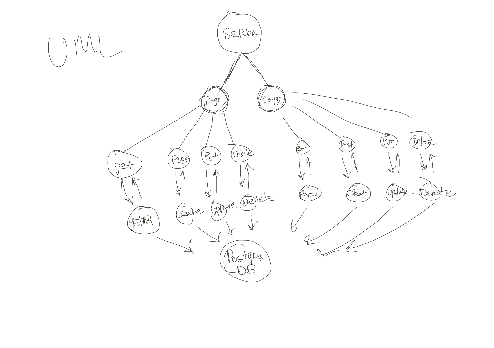

# basic-api-server
Dynamic API Phase 2: Perform CRUD Operations on a database

# class-03-rest

Author: Tek Jones

Demo REST API with full CRUD

Deployed Links:
  In Progress

## UML

## Routes

### /dogs

#### GET

- Status Code 200
- JSON response:
  - Returns and array of `dogs` containing
    - breed: STRING
    - age: NUMBER

#### POST

- Status Code 200
- JSON response:
  - Creates a new `dogs` item
  - Returns a newly created `dogs` item containing:
    - breed: STRING
    - age: NUMBER

### /dogs/:dogsId

#### GET

- Status Code 200
- JSON response:
  - Returns a single instance `dogs` based on the `dogsId` containing:
    - breed: STRING
    - age: NUMBER

#### PUT

- Status Code 200
- JSON response:
  - Updates a single instance of `dogs` based on the `dogsId`, returns newly updated item containing:
    - breed: STRING
    - age: NUMBER

#### DELETE

- Status Code 204
- Removes a single instance of `dogs` based on the `dogsId`, no body:

---------------------------------------------

### /songs

#### GET

- Status Code 200
- JSON response:
  - Returns and array of `songs` containing
    - name: STRING
    - year: NUMBER

#### POST

- Status Code 200
- JSON response:
  - Creates a new `songs` item
  - Returns a newly created `songs` item containing:
    - name: STRING
    - year: NUMBER

### /dogs/:dogsId

#### GET

- Status Code 200
- JSON response:
  - Returns a single instance `songs` based on the `songsId` containing:
    - name: STRING
    - year: NUMBER

#### PUT

- Status Code 200
- JSON response:
  - Updates a single instance of `songs` based on the `songsId`, returns newly updated item containing:
    - name: STRING
    - year: NUMBER

#### DELETE

- Status Code 204
- Removes a single instance of `songs` based on the `songsId`, no body: